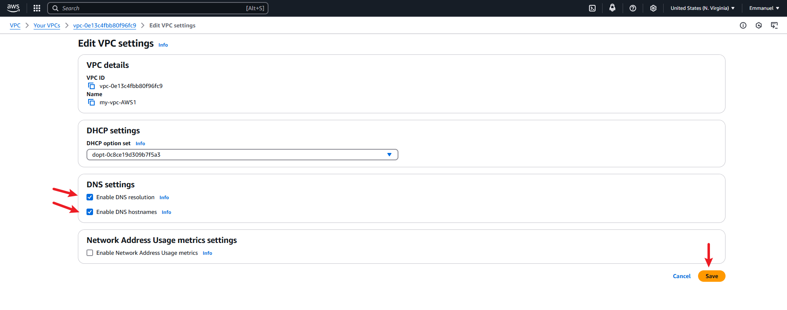

# Database-management-with-Amazon-RDS
This project focuses on essential tasks such as creating an AWS RDS database, connecting it to EC2 instance, and accessing the contents of the database and its tables.

 It  emphasizes on the importance of having a reliable database system for businesses and setting up databases using Amazon RDS (Relational Database Service). The project helps to understand the critical role of database management in handling client data and project workflows.

##  Relational Database Service (RDS)
  The first step is creating a Relationnal Database Service (RDS) "my-rds-database" and setting up the relational database management system (RDBMS) to make sure the data are well structured, organised and secured as shown in the steps below:
  
  
  
  
    * Note: make sure the security Group is configured properly i.e adding an inbound rule for MySQL/Aurora on port 3306 which allows traffic from the 0.0.0.0/0 CIDR range:

    * Note: the DNS resolution and hostname must be enabled on the VPC 

After the successful creation of the RDS, the endpoint is copied and kept securely as it would be required for connection soon:

By connecting to the ec2 instance "my-rds-instance" on ubuntu using the SSH :

after successfully connecting to the instance we execute the commands to set up our SQL locally in order to access the contents of the database and its tables shown below :
the first command was to connect to the repository of "MySQL57" server :

after which i install the "Mysql-community-server"

 After successfully installing ther sever i connected the endpoint of the Relational Database "my-rds-database.ccpeko8m40a3.us-east-1.rds.amazonaws.com" from Amazon AWS,
i was able to successfully connect to the database on MySQL as shown below where i accessed the content of the database which were"information_shema mysql and performance_schema sys", also i was able to see the contents of the tables as shown below:

